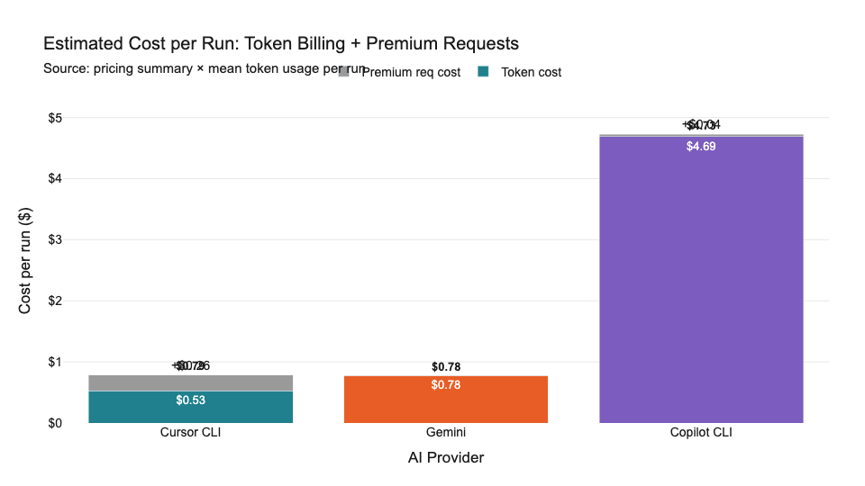

# AI Provider Token Consumption Billing Report
### Task: `react-nextjs-fe` (Aurora Simulation Lab) · Benchmark Date: 2026-05-22
**Prepared by:** IAG Transform AI — Engineering Assessment
**Classification:** Internal Technical Assessment · **Version:** 1.1

---

## 1. Executive Summary

> **3-30-300 Rule applied:** 3 seconds to scan the table → 30 seconds to read the headline → 300 seconds for the full report.

### Purpose

All major AI providers are transitioning from flat subscription pricing to **token-consumption billing**. This report quantifies what that shift means financially, using 57 controlled benchmark runs across three tools — **Copilot CLI** (GitHub/OpenAI), **Cursor CLI**, and **Gemini** (Google) — all executing the same coding task under identical environment conditions.

### The One-Line Verdict

**Use Cursor CLI.** It delivers the best quality, at the lowest per-run cost, consuming a fraction of the tokens of its nearest competitor.

### Decision Table

| Metric | Cursor CLI | Gemini | Copilot CLI |
|---|---|---|---|
| Model | Composer 2 Fast | Gemini 3.1 Pro Preview | GPT-5.4 |
| Runs in benchmark | 25 | 4 | 28 |
| **Mean task tokens / run** | **660K** | 496K | **3,260K** |
| **Mean score (0–10)** | **8.83** | 8.15 | 8.38 |
| Mean confidence (0–1) | 0.92 | 0.94 | 0.89 |
| **Mean outcome** (score × conf) | **8.15** | 7.67 | 7.52 |
| Token cost / run | $0.53 | $0.78 | $4.69 |
| Premium req cost / run | $0.26 | $0.00 | $0.04 |
| **Total cost / run** | **$0.79** | $0.78 | **$4.73** |
| **Outcome per dollar** | **15.94** | 9.87 | **1.60** |
| Outcome per million task tokens | 13.15 | 16.38 | 3.19 |

> ⚠️ **Pricing caveat:** Token list prices extracted from public provider pages as of 2026-05-20. Enterprise agreements may differ. Gemini has no premium request price recorded.

### Three-Signal Summary

1. **Quality is comparable across all three** (scores range 8.15–8.83 out of 10), so cost and efficiency are the differentiators.
2. **Copilot consumes 4.95× more task tokens than Cursor** for the same task. Under token billing, that is a 4.95× higher raw token bill before model price differences.
3. **Cursor delivers 10× more outcome per dollar than Copilot** ($15.94 vs $1.60). Gemini falls in between at $9.87 but has only 4 runs in the dataset.

---

## 2. Data Sources & Extraction

### 2.1 Input Files

| File | Purpose | Rows |
|---|---|---|
| `runs_summary_20260522T092710Z.csv` | Raw benchmark execution records | 57 |
| `pricing_summary.csv` | Token list prices per model per provider | 63 |
| `benchmark_comparison_report.md` | Derived aggregate metrics & worked calculations | Reference |
| `Copilot-with-price-comparison-250526-073304.pdf` | Visual evidence & formula validation | Reference |

### 2.2 Run Scope

All 57 runs executed the **`react-nextjs-fe`** task: building an Aurora Simulation Lab Next.js / React Three Fiber frontend application. Each run was triggered through a CI pipeline using `iag-ai-awesome-tool` configuration management, ensuring identical task definition, project scaffold, and evaluation rubric across all providers.

**Environment controls:**
- Same task prompt and project skeleton for all runs
- Independent evaluator pass (using a separate model) to score each result
- TASK MCP flag recorded separately from EVALUATOR MCP (20/57 runs used MCP at task level)
- No browser automation (Playwright/MCP) was available in most Cursor runs; scoring was conservative where live interaction could not be confirmed

### 2.3 Column Definitions

| Column | Definition |
|---|---|
| `task_tokens` | Total tokens consumed by the AI agent during the task (not the evaluator) |
| `Input tokens` | Prompt/context tokens sent to the model |
| `Output tokens` | Generated tokens returned by the model |
| `Cache Read tokens` | Tokens served from provider-side prompt cache (billed at cache-read price) |
| `Scoring` | Evaluator score 0–10 |
| `Confidence` | Evaluator's self-assessed certainty 0–1 |
| `Premium Request` | Fast/priority request count consumed (Copilot = 1 per run; Cursor = 5–8 range) |

---

## 3. Formulas & Calculations

Every number in the executive summary follows this deterministic chain. Symbols used throughout:

- **S** = Scoring (0–10)
- **C** = Confidence (0–1)
- **T** = task tokens for a single run
- **P\_{in}, P\_{out}, P\_{cache}** = list price per million tokens (input, output, cache read)

### Step 1 — Parse Task Tokens

Read the `task_tokens` cell; strip formatting (commas, K/M suffixes). Store as integer **T**.

### Step 2 — Weighted Outcome (delta\_score)

\[
\text{outcome}_i = S_i \times C_i
\]

Example: S = 9.0, C = 0.95 → outcome = **8.55**. Low confidence penalises a high raw score.

### Step 3 — Outcome per Million Task Tokens

\[
\text{outcome\_per\_M\_tok} = \frac{\text{outcome}_i}{T_i / 1{,}000{,}000}
\]

Example: outcome = 8.55, T = 500,000 → T\_m = 0.5 → outcome\_per\_M\_tok = **17.1**.

### Step 4 — Provider Aggregates (Arithmetic Mean)

For a provider with **n** runs:

\[
\bar{T}_{in} = \frac{1}{n}\sum_{i=1}^{n} T_{in,i} \qquad
\bar{T}_{out} = \frac{1}{n}\sum_{i=1}^{n} T_{out,i} \qquad
\bar{T}_{cache} = \frac{1}{n}\sum_{i=1}^{n} T_{cache,i}
\]

Mean outcome, score, and confidence follow the same arithmetic average pattern.

### Step 5 — Cost per Run

\[
\text{cost\_input} = \frac{\bar{T}_{in}}{1{,}000{,}000} \times P_{in}
\]

\[
\text{cost\_output} = \frac{\bar{T}_{out}}{1{,}000{,}000} \times P_{out}
\]

\[
\text{cost\_cache} = \frac{\bar{T}_{cache}}{1{,}000{,}000} \times P_{cache}
\]

\[
\text{cost\_token} = \text{cost\_input} + \text{cost\_output} + \text{cost\_cache}
\]

\[
\text{cost\_total} = \text{cost\_token} + (\text{premium\_req} \times P_{premium})
\]

### Step 6 — Outcome per Dollar

\[
\text{outcome\_per\_dollar} = \frac{\sum_{i} \text{outcome}_i}{\sum_{i} \text{cost}_i}
\]

Computed as total outcome divided by total cost across all provider runs (not as a mean of per-run ratios), to avoid distortion from cheap low-quality runs.

### Step 7 — Token-Billing Ratio (Same-Price Thought Experiment)

If all providers paid the same price **P** per million tokens:

\[
\text{ratio} = \frac{\bar{T}_{Copilot}}{\bar{T}_{Cursor}} = \frac{3{,}260{,}000}{659{,}770} \approx 4.95\times
\]

Copilot's token bill would be approximately **4.95× higher** than Cursor's at equal per-token pricing.

---

## 4. Pricing Reference

List prices extracted from public provider pages (effective 2026-05-20):

| Provider | Model | Input ($/M) | Output ($/M) | Cache Read ($/M) | Premium Req ($) |
|---|---|---|---|---|---|
| GitHub Copilot | GPT-5.4 | $2.50 | $15.00 | $0.25 | $0.04/req |
| Cursor | Composer 2 Fast | $1.50 | $7.50 | $0.35 | $0.04/req |
| Google | Gemini 3.1 Pro Preview | $2.00 | $12.00 | $0.20 | — |

**Key observation:** Output tokens are the most expensive bucket on all platforms. Copilot's output price ($15/M) is 2× Cursor's ($7.50/M), amplifying the cost difference beyond raw token volume alone.

---

## 5. Token Consumption Analysis

### 5.1 Token Breakdown by Bucket

| Provider | Mean Input (K) | Mean Output (K) | Mean Cache Read (K) | Total Billed (K) |
|---|---|---|---|---|
| Cursor CLI | 116.0 | 20.5 | 568.8 | **659.8** |
| Gemini | 370.5 | 0.9 | 124.8 | **496.2** |
| Copilot CLI | 1,630.0 | 13.1 | 1,610.0 | **3,260.0** |

Copilot's token profile is dominated by **very large input and cache-read buckets** — its mean input alone (1.63M) exceeds Cursor's entire task token budget (660K) by 2.5×. This pattern is consistent across all 28 Copilot runs, suggesting its context management strategy does not compress or prune the prompt window aggressively.

### 5.2 Cost Decomposition

| Provider | Input $ | Output $ | Cache Read $ | Token Total $ | Premium $ | **Run Total $** |
|---|---|---|---|---|---|---|
| Cursor CLI | $0.174 | $0.154 | $0.199 | $0.527 | $0.26 | **$0.787** |
| Gemini | $0.741 | $0.011 | $0.025 | $0.777 | $0.00 | **$0.777** |
| Copilot CLI | $4.087 | $0.196 | $0.403 | $4.686 | $0.04 | **$4.726** |

Cursor's premium request cost ($0.26) nearly equals its token cost ($0.527). If Cursor's premium pricing changes, its total cost could increase significantly — a risk not present for Gemini.

---

## 6. Quality & Efficiency Analysis

### 6.1 Quality Metrics

| Provider | Mean Score | Mean Confidence | Mean Outcome | Pearson r (tokens vs score) |
|---|---|---|---|---|
| Cursor CLI | 8.83 | 0.92 | **8.15** | +0.39 (more tokens → slightly better) |
| Gemini | 8.15 | 0.94 | 7.67 | n/a (only 4 runs) |
| Copilot CLI | 8.38 | 0.89 | 7.52 | −0.03 (no meaningful link) |

Cursor CLI shows the highest mean score **and** highest confidence, making it the clear quality leader. Gemini's confidence (0.94) is the highest but its sample (4 runs) is too small to be conclusive. Copilot's Pearson r ≈ −0.03 confirms that spending more tokens does **not** improve output quality.

### 6.2 Efficiency Ratios

| Provider | Outcome/$ | Outcome/M tok | Cost/M tok ($) |
|---|---|---|---|
| Cursor CLI | **15.94** | 13.15 | $0.80 |
| Gemini | 9.87 | **16.38** | $1.57 |
| Copilot CLI | 1.60 | 3.19 | $1.44 |

Gemini is the most **token-efficient** (best outcome per million tokens consumed), but it is not the most **cost-efficient** (outcome per dollar) because its per-token prices are higher than Cursor's. Copilot is last on both metrics.

---

## 7. Key Findings

### Finding 1 — Token Billing Changes the Economics Fundamentally

Under flat subscription pricing, Copilot's high token consumption had no direct cost impact. Under token billing, it becomes a **4.95× cost multiplier** relative to Cursor. The transition to consumption-based pricing favours tools with efficient context management.

### Finding 2 — Quality Parity Removes the Performance Argument

All three providers scored between 8.15 and 8.83 on the same task. There is no statistically meaningful quality gap that would justify paying Copilot's premium. More tokens ≠ better results (Pearson r ≈ −0.03 for Copilot).

### Finding 3 — Cursor's Hidden Premium Request Risk

Cursor consumes 5–8 premium requests per task. At $0.04 each, that adds $0.20–$0.32 per run today. If Cursor restructures its premium pricing (e.g., raises per-request cost or caps monthly allocations), Cursor's total cost could rise materially. This is a **pricing risk to monitor**.

### Finding 4 — Gemini Needs More Data

Gemini's 4-run sample size prevents reliable statistical conclusions. Its strong token efficiency metric (16.38 outcome/M tokens) and high evaluator confidence (0.94) make it a candidate for a larger evaluation round.

### Finding 5 — MCP Configuration Affects Evaluator Quality

Cursor and Gemini had MCP configuration errors in several runs, preventing browser-based end-to-end verification. Evaluator scores were consequently conservative (static code review only). Correcting this would likely increase both confidence and outcome scores, improving Cursor's and Gemini's apparent ratios further.

---

## 8. Recommendations

| Action | Priority | Rationale |
|---|---|---|
| Standardise on **Cursor CLI** for `react-nextjs-fe` tasks | High | Best quality, best cost-efficiency, 6× cheaper per run than Copilot |
| Run a **Gemini extended benchmark** (≥20 runs) | Medium | Insufficient data to confirm or refute 16.38 token-efficiency claim |
| Fix **MCP browser configuration** (Playwright) for all providers | High | Evaluator confidence is artificially depressed; correcting this produces more accurate scoring |
| Monitor **Cursor premium request pricing** | Medium | $0.26/run (33% of total cost) is a variable; any price increase changes the cost equation |
| Avoid **Copilot CLI for token-billed workloads** until context compression improves | High | 4.95× token overhead with no quality benefit; $4.73/run vs $0.79 |

---

## 9. Charts & Visual Evidence

### Chart A — Estimated Cost per Run

Token cost (stacked) and premium request cost per average run. Copilot CLI's total ($4.73) dwarfs both Cursor CLI ($0.79) and Gemini ($0.78).

### Chart B — Outcome per Dollar

Value efficiency: outcome units delivered per dollar spent. Cursor CLI (15.94) is 10× Copilot CLI (1.60).

### Chart C — Outcome per Million Task Tokens

Token efficiency: outcome per million task tokens consumed. Gemini leads (16.38) followed by Cursor (13.15). Copilot is at 3.19 — less than one-quarter of Gemini's rate.

### Chart D — Mean Task Tokens per Run

Raw token volume comparison. Copilot (3.26M) consumes nearly 5× more task tokens than Cursor (660K) for the same result.

### Chart E — Multi-Dimension Radar

Normalized (0–1) comparison across quality score, confidence, outcome, token efficiency, and cost value. Cursor CLI dominates three of five dimensions; Gemini leads on token efficiency.

---

## Annex A — Sample Run Data (Representative Runs)

| Provider | Date | Score | Conf | Task Tokens | Input | Output | Cache Read |
|---|---|---|---|---|---|---|---|
| Cursor CLI | 2026-05-20 | 9.6 | 0.94 | 786,500 | 19,900 | 21,200 | 745,400 |
| Cursor CLI | 2026-05-15 | 9.4 | 0.94 | 752,900 | 103,100 | 22,200 | 627,600 |
| Cursor CLI | 2026-05-15 | 9.2 | 0.93 | 760,400 | 94,000 | 21,700 | 644,700 |
| Gemini | 2026-05-21 | 9.0 | 0.95 | 1,041,559 | 487,100 | 859 | 202,400 |
| Gemini | 2026-05-21 | 8.8 | 0.93 | 590,554 | 319,600 | 954 | 70,200 |
| Gemini | 2026-05-21 | 6.0 | 0.96 | 777,746 | 355,500 | 846 | 156,500 |
| Copilot CLI | 2026-05-15 | 9.4 | 0.96 | 933,600 | 101,300 | 27,600 | 804,700 |
| Copilot CLI | 2026-05-15 | 8.7 | 0.95 | 4,234,100 | 2,100,000 | 24,900 | 2,100,000 |
| Copilot CLI | 2026-05-15 | 8.2 | 0.95 | 7,035,000 | 3,500,000 | 25,100 | 3,500,000 |

> Full raw data: `runs_summary_20260522T092710Z.csv` (57 rows)

## Annex B — Worked Cost Calculation: Cursor CLI

Mean token buckets across 25 runs:
- \(\bar{T}_{in}\) = 115,990
- \(\bar{T}_{out}\) = 20,510
- \(\bar{T}_{cache}\) = 568,770

Prices (Composer 2 Fast): Input $1.50/M · Output $7.50/M · Cache $0.35/M

\[
\text{cost\_input}  = (115{,}990 \div 1{,}000{,}000) \times 1.50 = \$0.1740
\]
\[
\text{cost\_output} = (20{,}510 \div 1{,}000{,}000) \times 7.50 = \$0.1538
\]
\[
\text{cost\_cache}  = (568{,}770 \div 1{,}000{,}000) \times 0.35 = \$0.1991
\]
\[
\text{cost\_token}  = 0.1740 + 0.1538 + 0.1991 = \$0.5269
\]
\[
\text{cost\_premium} = 6.5 \times \$0.04 = \$0.26
\]
\[
\text{cost\_total} = 0.5269 + 0.26 = \mathbf{\$0.7869}
\]

## Annex C — Worked Cost Calculation: Copilot CLI

Mean token buckets across 28 runs:
- \(\bar{T}_{in}\) = 1,630,000
- \(\bar{T}_{out}\) = 13,080
- \(\bar{T}_{cache}\) = 1,610,000

Prices (GPT-5.4): Input $2.50/M · Output $15.00/M · Cache $0.25/M

\[
\text{cost\_input}  = (1{,}630{,}000 \div 1{,}000{,}000) \times 2.50 = \$4.0871
\]
\[
\text{cost\_output} = (13{,}080 \div 1{,}000{,}000) \times 15.00 = \$0.1962
\]
\[
\text{cost\_cache}  = (1{,}610{,}000 \div 1{,}000{,}000) \times 0.25 = \$0.4030
\]
\[
\text{cost\_token}  = 4.0871 + 0.1962 + 0.4030 = \$4.6863
\]
\[
\text{cost\_premium} = 1 \times \$0.04 = \$0.04
\]
\[
\text{cost\_total} = 4.6863 + 0.04 = \mathbf{\$4.7263}
\]

## Annex D — Worked Cost Calculation: Gemini

Mean token buckets across 4 runs:
- \(\bar{T}_{in}\) = 370,450
- \(\bar{T}_{out}\) = 903
- \(\bar{T}_{cache}\) = 124,830

Prices (Gemini 3.1 Pro Preview): Input $2.00/M · Output $12.00/M · Cache $0.20/M

\[
\text{cost\_input}  = (370{,}450 \div 1{,}000{,}000) \times 2.00 = \$0.7409
\]
\[
\text{cost\_output} = (903 \div 1{,}000{,}000) \times 12.00 = \$0.0108
\]
\[
\text{cost\_cache}  = (124{,}830 \div 1{,}000{,}000) \times 0.20 = \$0.0250
\]
\[
\text{cost\_total} = 0.7409 + 0.0108 + 0.0250 = \mathbf{\$0.7767}
\]

## Annex E — Full Pricing Reference (pricing\_summary.csv extract)

Selected models only. Full file contains 63 rows across GitHub Copilot, Cursor, and Google.

| Provider | Model | Input ($/M) | Output ($/M) | Cache Read ($/M) | Cache Write ($/M) | Premium Req ($) |
|---|---|---|---|---|---|---|
| GitHub Copilot | GPT-5.4 | $2.50 | $15.00 | $0.25 | — | $0.04 |
| GitHub Copilot | GPT-5.5 | $5.00 | $30.00 | $0.50 | — | — |
| GitHub Copilot | Claude Sonnet 4.6 | $3.00 | $15.00 | $0.30 | $3.75 | — |
| Cursor | Composer 2 Fast | $1.50 | $7.50 | $0.35 | — | $0.04 |
| Cursor | Composer 2.5 Fast | $3.00 | $15.00 | $0.50 | — | — |
| Cursor | API Pool – GPT-5.4 | $2.50 | $15.00 | $0.25 | — | — |
| Google | Gemini 3.1 Pro Preview | $2.00 | $12.00 | $0.20 | — | — |

---

*Report generated: 2026-05-25 · Data effective: 2026-05-22 · IAG Transform AI — Engineering Assessment*
